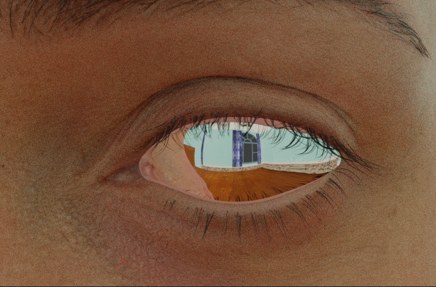
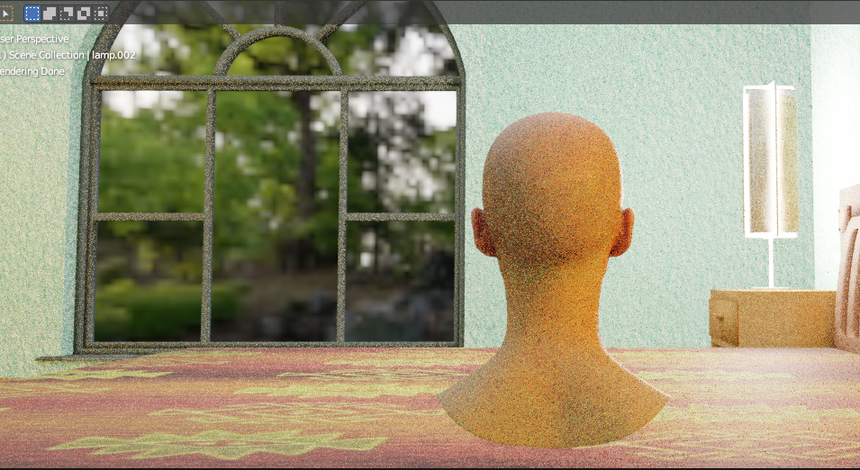
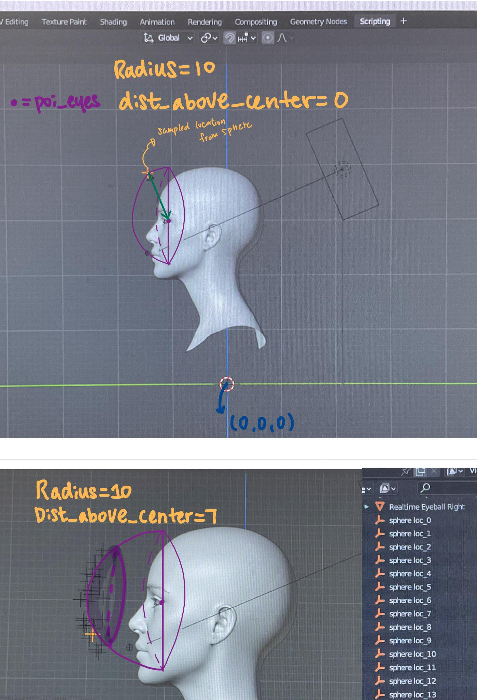

# 3D scene reconstruction via eye-reflection
This repository is the code base of a Hiwi Project 

* Author: YeonJoo Cho  

## Abstract
This project aims to generate the eye-image dataset for 3D scene reconstruction via eye-reflection 

## Requirements 
- #### Download [BlenderProc](https://github.com/DLR-RM/BlenderProc)
    - BlenderProc2 is the main platform to deploy the 3D scene and capture images
    - Good amount of [Tutorials](https://github.com/DLR-RM/BlenderProc/tree/main/examples) are provided for learning the tool
- #### Download [SceneNet](https://robotvault.bitbucket.io/) dataset
    - Instructions can be found [here](https://github.com/DLR-RM/BlenderProc/blob/main/examples/datasets/scenenet/README.md)
    - The relevant texture_library **MUST** be downloaded
- #### Download HDRIs 
    - Can be individually downloaded from this [link](https://polyhaven.com/hdris)
    - .exr files **MUST** be stored as '/world/hris' in the main directory, since we use an API provided by BlenderProc
    - For further understanding, please refer to [haven-dataset-tutorial](https://github.com/DLR-RM/BlenderProc/blob/main/examples/datasets/haven/README.md)
- #### Head model(.blend file) 
    - Free head model can be downloaded in the [3D scan store](https://www.3dscanstore.com/blog/Free-3D-Head-Model)  
    - .blend file must be in the main directory
    - 'Textures' folder for the blender model should be located in a correct directory since it causes a mess if not. Please check the location of the texture file in the object's material nodes during debug mode.(In my case, it had to be located outside of the main directory) 

## Rendering

To sample images, simply run:

```
blenderproc run main_head.py --scene_net_obj_path --scene_texture_path --hdri_path
```
To debug and deploy the 3D scene, simply run:

```
blenderproc debug main_head.py --scene_net_obj_path --scene_texture_path --hdri_path
```
Several options can be modified from the file:
| Command | Description |
| --- | --- |
| --scene_net_obj_path | path to the individual .obj file from SceneNet dataset | 
| --scene_texture_path | path to the texture_library for SceneNet dataset |
| --hdri_path| path to the 'world' directory, where the hdris are stored|
  

## Satus
- Head model is wrapped into one object
    - .blend file has the following mesh objects: [Head, Tongue, Teeth, Realtime Eyeball Right, Realtime Eyeball Left, Lens Right, Lens Left, Lashes, Head, Eye Wet, Brows]
    - For unified transformation(translation/rotation) of the head object, 'Head' is set as the parent object of all the other components 

- Eye Reflection
    - Emission shader is added to all the scene objects, to enable reflection in the mirror texture of the eye
    - Glossy shader is added to the eyeLens, to realize the mirror-like texture
<br><br><br> 

- Sampling 
    - Computes the POI(PointOfInterest) of the eye, which is the target position of the camera
    - Camera position is in the direction of -yAxis of the computed eye POI 

- Random selects HDRIs for the virtual background 
     <br><br><br> 

## Side Notes
- Since Blenderproc does not provide a good amount of python-friendly methods, manually extracting and combining useful parts in the existing APIs are required 

- Eye Lenses are moved forward(Y-Coords) to decrease the reflection of the head model
<br>(original / yCoords +0.2)<br>
<br><br>
- Raycasting API may be useful to random transform the head object to various locations

- main_head_org.py: simplest version, loading SceneNet and Head model + sampling method:sphere
```
location = bproc.sampler.part_sphere(center=poi_head, radius=12, part_sphere_dir_vector=[0, -1, 0], mode="SURFACE", dist_above_center=8.0)
```
<br><br>

## References
- [The World in an Eye](https://world-from-eyes.github.io/), CVPR 04
- [Seeing the World through Your Eyes](https://cave.cs.columbia.edu/old/publications/pdfs/Nishino_CVPR04.pdf), CVPR 24
